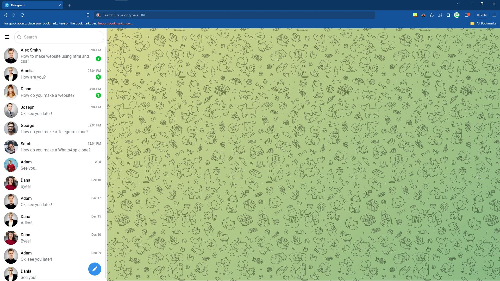
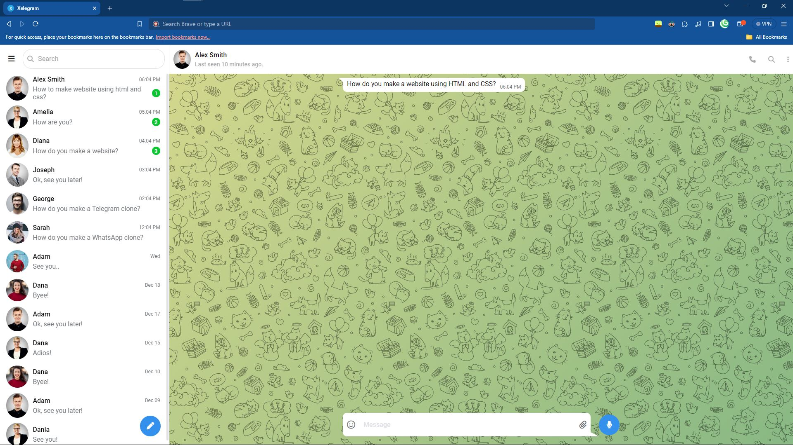

# Xelegram

A clone of the Telegram chat website. This is a backup for my hard-disk, just incase they fail. And a place for you to start from, for you.

The assets can be foundL [here](https://github.com/salimi2991/telegram-clone)

**(Thanks Front End With Salimi!)**


## Acknowledgements

 - Tutorial by: [Front End With Salimi](https://www.youtube.com/@frontendwithsalimi)
 
 - Huge shout-out to my youngest project, as of writing this: [XApp](https://github.com/l-xdt/xapp/)

 - A huge help in this project: [Diffchecker](https://www.diffchecker.com/)


## Authors

- [LeidenSchaft-Xiotim Development Team](https://www.github.com/octokatherine)

- [Alvin Maranx, II ツ (Avun)](https://www.github.com/avunii/)

- [Front End With Salimi](https://www.youtube.com/@frontendwithsalimi)


## Demo

There is ademo on this project! And I'm not neing indirect, here is the link: click [here](https://l-xdt.github.io/xelegram/)


## Features

- Message bubbles.

- Changable avatars.

- Change the UI colors.

- Change messages.

- **PS:** A little more features added, but it still needs some input.


## Screenshots





**Written in plain HTML, CSS and JavaScript. The rest, you need to figure out.**


## Run Locally

Clone the project and Run it on XAMPP

```bash
  git clone https://github.com/l-xdt/xelegram/
```

Go to the project directory

```bash
  cd xelegram
```

Install XAMPP (via Chocalatey, if you don't have it).

```bash
  chocalatey install xampp
```

Start the server

```bash
  [Directory]/[ServerName]/apache-start.bat
```
**PS**: If you trust your web skills, here is a manual on how to self host a domain [here](https://www.youtube.com/watch?v=_eQGAJVtRCs) (by Soeng Souy)

## Roadmap

- Additional browser support

- Change avatars.

- Change the message handles to whatever you would like.

- Change the last seens, online and offline texts to what you would like.

- Change what icons you would like to see.

- Change the Favicon, inspired (of-course) by our signature: **X**

- Change the code to be what you want.

- Written in **Vanilla HTML, CSS and Javascript**


## Support

For support, reach out to us via either of our emails: [this one](mailto:trowesigames@gmail.com) or [this one](mailto:leidenschaft.tech@gmail.com)  or join our Discord server: which is not up as of writing this.


## Feedback

This still applies to feedback as well, Whether you want to give us positive words, or negative ones, send away. (but please only send constructive-critisism).

Send away: [here](mailto:trowesigames@gmail.com) or [here](mailto:leidenschaft.tech@hotmail.com)

## FAQ

**Now, my fav, FAQ!**

#### Can I modify this to fit my needs?

Totally! That is what we make these repositories for. For you tinker and to try new things.

#### Can I host this? If I can how?

You can! with my favourite Apache container, XAMPP! Since I have explained it atleast 12 times, we can skip it.

If you want to go ahead with it, you can get started by hosting your websites, click [here](https://www.youtube.com/watch?v=LzucEZh4_no) to following the tutorial by MainlyWebStuff.

And for a domain, click [here](https://www.youtube.com/watch?v=_eQGAJVtRCs) to follow the tutorial by Soeng Souy


## Used By

This project is used by the following companies:

- LeidenSchaft-Xiotim Acquisitions (Limited)

- XDT-Studium

- Xiotim Development Team [Limited] (XDT)

- XDT-noHesi


## Related

Here are some related projects:

- [XioTok](https://github.com/l-xdt/xiotok/)

- [noHesi](https://github.com/l-xdt/no-hesi/)

- [Xirox](https://github.com/l-xdt/xirox/)

- [Studium](https://github.com/l-xdt/studium/)

- [XioTim](https://github.com/l-xdt/xiotim/)

- [XioTube](https://github.com/l-xdt/xiotube/)

- [xSocial](https://github.com/l-xdt/xSocial/)

- [XGram](https://github.com/l-xdt/xgram/)

- [XChat](https://github.com/l-xdt/xchat/)

- [XCord](https://github.com/l-xdt/xcord/)

- [XApp](https://github.com/l-xdt/xapp/)


## Documentation

- Although I cannot tell you all about the project (yet), you can go and check out the tutorial, linked below:

- [Telegram Clone](https://www.youtube.com/watch?v=aMi8_FVUSdY) by Front End with Salimi (on YouTube)


## API Reference

As earlier mentioned, there is no APIs and/or Frameworks, just Icons. This project is very base-level, if there is any. I will update this readMe.

